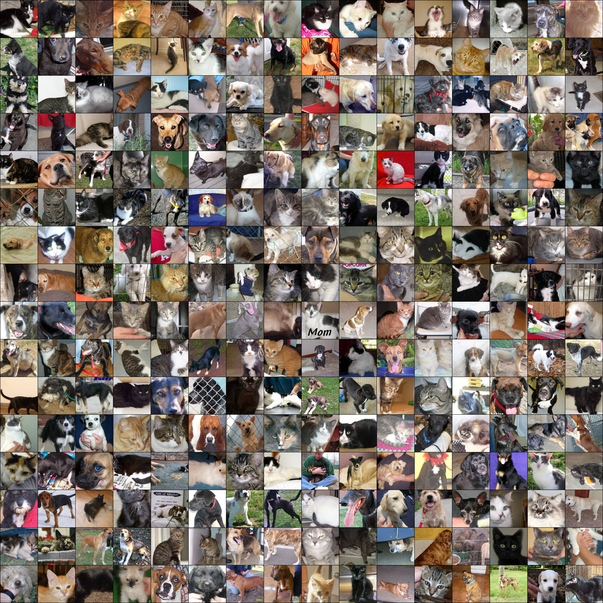

# Visual Transformers: Cats vs. Dogs Classification


A machine learning project utilizing Visual Transformers (ViTs) to classify images from the Cats vs. Dogs dataset.


  


## Table of Contents

- [Introduction](#introduction)
- [Installation](#installation)
- [Usage](#usage)
- [Results](#results)
- [Contribute](#contribute)
- [Acknowledgements](#acknowledgements)

## Introduction

The Cats vs. Dogs dataset is a standard computer vision dataset that contains images of cats and dogs. In this project, instead of using conventional CNNs, we utilize Visual Transformers (ViTs). The Cats vs. Dogs dataset is only a small collection of 25K annotated images. The purpose of this project is to see if we can use MAE to pretrain the model to achieve a better result than simply trainining from random initialisation. 

  

## Installation

**Requirements**: Python 3.8+ 

1. Clone the repository:
   ```bash
   git clone https://github.com/yourusername/cats-vs-dogs-vit.git
   cd cats-vs-dogs-vit
   ```

2. Install the required packages:
   ```bash
   pip install -r requirements.txt
   ```

## Usage

To train the model:

```bash
python train.py
```

To evaluate the model:

```bash
python evaluate.py
```

## Results

We achieved an accuracy of 83.46% on a randomly sampled validation set of 2500 images using a ViT with random weight initialisation. If we used a pretrained network trained use MAE then the final accuracy on the same validation set was 93.29%. Also of note that we reached this accuracy around 80 epochs where the best performance from random initialisation was reached only after 158 epochs. 

| Model           | Accuracy (%) |
|-----------------|--------------|
| Visual Transformer | 83.46         |
| Visual Transformer + MAE | 93.29         |


## Acknowledgements

- Thanks to the creators of the [Cats vs. Dogs dataset](https://www.kaggle.com/c/dogs-vs-cats).
- Inspired by the [MAE paper](https://arxiv.org/abs/2111.06377).

---

Ⓒ 2023 Mathew Salvaris. All Rights Reserved.